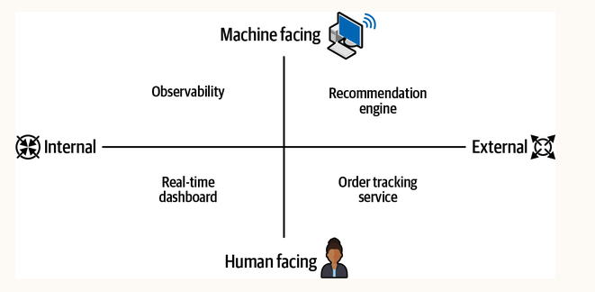
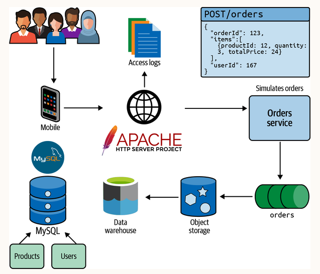
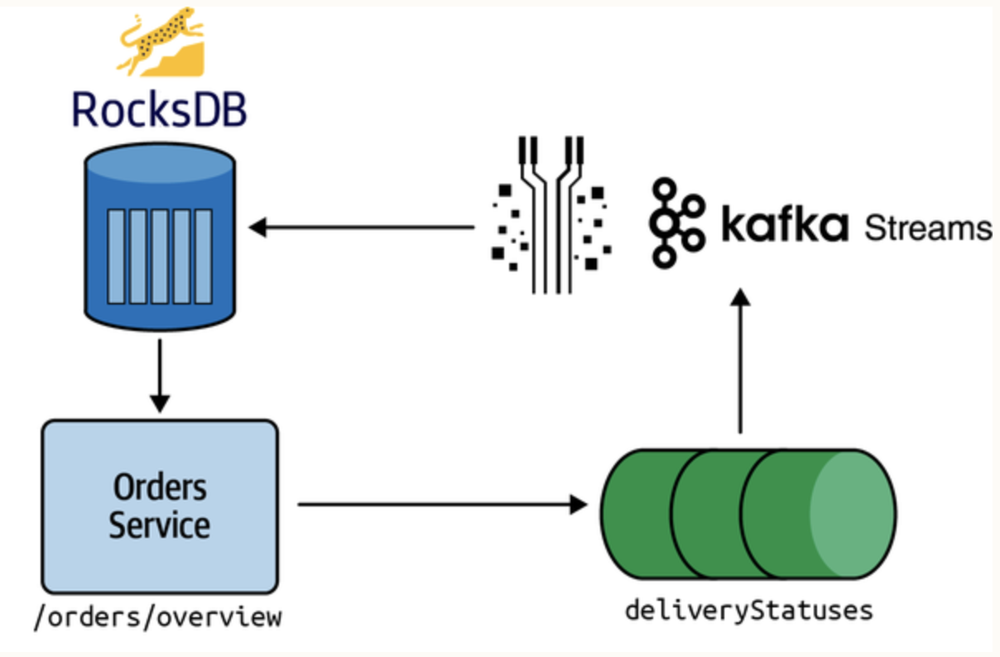
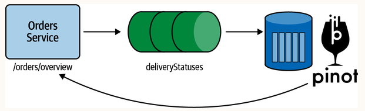
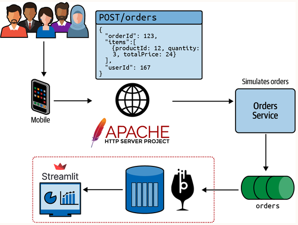
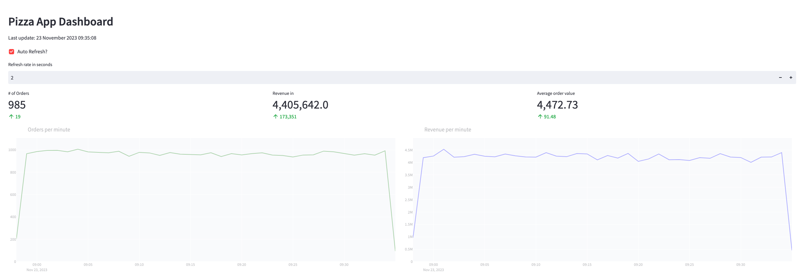
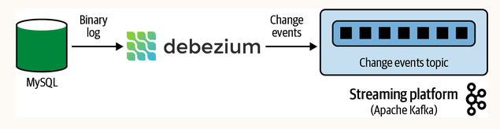
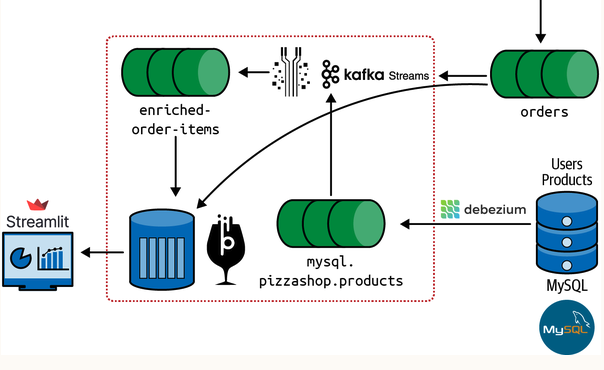
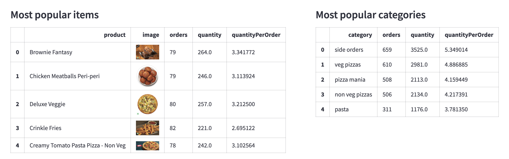

# real-time-analytics
Ready to use example for real-time data analytics

There are a variety of use cases for real-time analytics, and each use case has different requirements with respect 
to query throughput, query latency, query complexity, and data accuracy.

| Use case                    | Query throughput (queries/second) | Query latency (p95th) | Consistency & accuracy | Query complexity |
|-----------------------------|-----------------------------------|-----------------------|------------------------|------------------|
| User-facing analytics       | Very high                         | Very low              | Best effort            | Low              |
| Personalization             | Very high                         | Very low              | Best effort            | Low              |
| Metrics                     | High                              | Very low              | Accurate               | Low              |
| Anomaly detection           | Moderate                          | Very low              | Best effort            | Low              |
| Root-cause analytics        | High                              | Very low              | Best effort            | Low              |
| Visualizations & dashboards | Moderate                          | Low                   | Best effort            | Medium           |
| Ad hoc analytics            | Low                               | High                  | Best effort            | High             |
| Log analytics & text search | Moderate                          | Moderate              | Best effort            | Medium           |

# Applications of Real-Time Analytics
The following are some potential applications that we could build to solve various business problems:
- Human-based/internal: A dashboard showing the latest orders, revenue, products ordered, and customer satisfaction. This will allow operators to keep on top of what’s currently happening with the business and react to problems as they happen.
- Human-based/external: A web/mobile application that lets customers track order status and the time until their pizza gets delivered on a live map. This will allow users to plan for the arrival of their order and get an early indication if anything is going wrong with the order.
- Machine-based/internal: An anomaly detection system on access logs that sends alerts via Slack or email when unusual traffic patterns are detected. This will allow site reliability engineering (SRE) team to make sure the website is highly available and to detect denial-of-service attacks.
- Machine-based/external: A fraud detection system that detects and blocks fraudulent orders.



# Running locally
Once Docker Compose is installed, you can start everything by running the following command:
```sh
docker compose up
```
### Existing architecture

   
#### Components  
- [Order Service](orders-service)
  - Simulates a pizza order service that receives orders from customers and sends them to the `orders` topic for processing.
- [Mysql](docker/mysql)
  - Stores users and products data.
- Apache Kafka
  - Orders from the website are published to Kafka via the orders service.

#### Inspecting data
```sh
kcat -C -b localhost:29092 -t orders -c 1
```
Example output:
```json
{
  "id": "c6745d1f-cecb-4aa8-993b-6dea64d06f52",
  "createdAt": "2022-09-06T10:46:17.703283",
  "userId": 416,
  "status": "PLACED_ORDER",
  "price": 1040,
  "items": [
    {
      "productId": "21",
      "quantity": 2,
      "price": 45
    },
    {
      "productId": "36",
      "quantity": 3,
      "price": 60
    },
    {
      "productId": "72",
      "quantity": 2,
      "price": 385
    }
  ]
}
```

## Version 1. Creating dashboards using Kafka-Streams
Pizza Shop doesn't currently have real-time insight into the number of orders being placed or the revenue being generated. 
The company would like to know if there are spikes or dips in the numbers of orders so that it can react more quickly 
in the operations part of the business.
  
The Pizza Shop engineering team is already familiar with Kafka Streams from other applications that they’ve built, 
so we’re going to create a Kafka Streams app that exposes an HTTP endpoint showing recent orders and revenue.
We’ll build this app with the Quarkus framework, starting with a naive version. Then we’ll apply some optimizations. 
We’ll conclude with a summary of the limitations of using a stream processor to query streaming data. 

#### Architecture


#### Running locally
Running infrastructure:
```sh
docker compose up
```
Running the application:
```sh
cd app/pizzashop && ./mvnw compile quarkus:dev
```

#### Querying in counts in real-time from kafka-store
```
localhost:8080/orders/overview
```
Example output:
```json
{
  "currentTimePeriod": {
    "orders": 994,
    "totalPrice": 4496973
  },
  "previousTimePeriod": {
    "orders": 985,
    "totalPrice": 4535117
  }
}
```

### Limitations of Kafka Streams
While this approach for querying streams has been successful in many cases, certain factors could impact its efficacy.

The underlying database used by Kafka Streams is RocksDB, a key-value store that allows you to store and retrieve data 
using key-value pairs. This fork of Google’s LevelDB is optimized for write-heavy workloads with large datasets.

One of its constraints is that we can create only one index per key-value store. This means that if we decide to query 
the data along another dimension, we’ll need to update the topology to create another key-value store. If we do a 
non-key search, RocksDB will do a full scan to find the matching records, leading to high query latency.

Our key-value stores are also capturing only events that happened in the last one minute and the minute before that. 
If we wanted to capture data going further back, we’d need to update the topology to capture more events. In our case,
we could imagine a future use case where we’d want to compare the sales numbers from right now with the numbers from 
this same time last week or last month. This would be difficult to do in Kafka Streams because we’d need to store 
historical data, which would take up a lot of memory.

So although we can use Kafka Streams to write real-time analytics queries and it will do a reasonable job, we probably 
need to find a tool that better fits the problem.

## Version 2. Creating dashboards using Apache Pinot
Data warehouses are a form of OLAP database, but they aren’t suitable for real-time analytics because they don’t satisfy
the requirements in terms of ingestion latency, query latency, and concurrency.
  
Batch ETL pipelines are commonly used to populate big data warehouses such as `BigQuery` or `Redshift`. However, this causes 
ingestion latency and makes the data outdated when queried. Moreover, their query engines are not optimized for 
millisecond latency, but for ad hoc querying with acceptable latencies in the seconds. 
Finally, our serving layer needs to scale to thousands of queries per second if we’re building user-facing applications, 
which isn’t the sweet spot of data warehouses.

Instead we will use a real-time OLAP database, and it’s `Apache Pinot` that is going to perform the role of serving layer 
for our application. `Pinot` is a database that was created at LinkedIn in 2013, after the engineering staff determined
that no off-the-shelf solutions met the social networking site’s requirements of predictable low latency, data 
freshness in seconds, fault tolerance, and scalability. These are essential features for any organization that wants 
to obtain real-time insights from its data and make informed decisions quickly.

#### Architecture


#### Running locally
Running infrastructure:
```sh
docker compose -f compose.yaml -f compose-pinot.yaml up
```
Running the application:
```sh
cd app/pizzashop-pinot && ./mvnw compile quarkus:dev
```
  
#### Querying in counts in real-time from Apache Presto
```
localhost:8080/orders/overview
```
Example output:
```json
{
  "totalOrders": 17665,
  "currentTimePeriod": {
    "orders": 968,
    "totalPrice": 4313950.0
  },
  "previousTimePeriod": {
    "orders": 958,
    "totalPrice": 4281751.0
  }
}
```
## Building a Real-Time Analytics Dashboard
The current architecture includes the [Order Service](https://www.notion.so/gelerion/orders-service), which simulates 
users generating order events. These order events are produced to the Kafka topic named `orders`, consumed in real 
time by Pinot, and ingested into the [orders](https://www.notion.so/gelerion/docker/pinot/config/orders/table.json) 
table. We use a small rest service, [pizzashop](https://www.notion.so/gelerion/app/pizzashop-pinot), to query the data from Pinot.
  
We are going to build a [dashboards](https://www.notion.so/gelerion/dashboards) service for data visualization, 
using the Streamlit framework.  


  
### Running locally:
Remove everything:
```sh
docker compose \
      -f compose.yaml \
      -f compose-pinot-arm.yaml \
      -f compose-pizzashop.yaml \
      -f compose-dashboard.yaml \
      down --volumes
```

Run everything:
```sh
docker compose \
      -f compose.yaml \
      -f compose-pinot-arm.yaml \
      -f compose-pizzashop.yaml \
      -f compose-dashboard.yaml \
      up
```
### Dashboards
Dashboards are managed by the [dashboards](https://www.notion.so/gelerion/dashboards) service.
  

  
Links:
- Pinot UI: http://localhost:9000
- Dashboards UI: http://localhost:8501

## Capture Product changes using Debezium (CDC)
We get a solid overview of the number of orders and the revenue that the business is making. What’s 
missing is that they don’t know what’s happening at the product level.
  
The data about individual products is currently stored in the MySQL database, but we need to get it out of there and 
into our real-time analytics architecture.
  
Change data capture describes the process of capturing the changes made to data in a source system and 
then making them available to downstream/derived data systems. These changes could be new records, 
changes to existing records, or deleted records.  
`Debezium` is an open source, distributed platform for change data capture, written by RedHat. It 
consists of a set of connectors that run in a Kafka Connect cluster. Each connector works with a 
specific database, where it captures changes as they occur and then streams a record of each change 
event to a topic in Kafka. These events are then read from the Kafka topic by consuming applications.



#### Setup Debezium
```
  debezium:
    image: debezium/connect:2.4
    
  debezium_deploy:
    image: debezium/connect:2.4
    depends_on:
      debezium: {condition: service_healthy}
    volumes:
      - ./docker/debezium/register_mysql.sh:/register_mysql.sh
```
After starting the Debezium container, we need to register the MySQL connector with the Kafka Connect cluster.
  
#### Querying state changes
```
kcat -C -b localhost:29092 -t mysql.pizzashop.products -c1 | jq '.payload'
```
Example output
```
{
  "before": null,
  "after": {
    "id": 1,
    "name": "Moroccan Spice Pasta Pizza - Veg",
    "description": "A pizza with a combination of Harissa sauce & delicious pasta.",
    "category": "veg pizzas",
    "price": 335,
    "image": "https://oreil.ly/LCGSv",
    "created_at": "2022-12-05T16:56:02Z",
    "updated_at": 1670259362000
  }
}  
```

## Add most popular items and categories
Although the `orders` stream doesn't currently contain detailed information about products, we have set up Debezium to 
capture any changes to the MySQL `products` table and write them into the `products` stream. 
We need to combine the `orders` stream and `products` streams by using a stream processor.
We’ll put the new stream into Apache Pinot and update the dashboard with the top-selling products and categories.


  
To do so we need to create a `KTable` on top of the `products` stream and join with a `KStream` 
on top of the `orders` stream.
```
KStream<String, Order> orders = builder.stream("orders")
KTable<String, Product> products = builder.table("products")
orders.join(products).to("enriched-order-items")
```
  
Checkout the complete example:
[EnrichedOrdersTopology.java](app/pizzashop-pinot/src/main/java/pizzashop/kafka/EnrichedOrdersTopology.java)

Next, we need to add a new table and schema to Pinot that consumes the data from this new stream. 
See the example: [enriched-orders](docker/pinot/config/orders_items_enriched/schema.json)
  
Finally, we need to update the dashboard to show the top-selling products and categories. 
To do so, we need to update the `pizzashop` application to query the new table and expose the data via a new endpoint.
```
    @GET
    @Path("/popular")
    public Response popular() {
        return Response.ok()
                .entity(orderService.popular())
                .build();
    }
```
And update the [dashboard](dashboards/app.py) to query the new endpoint.
```
response = requests.get(f"{pizza_shop_service_api}/orders/popular").json()
```

### Dashboards with most popular items and categories



## Services
- [Order Service](orders-service)
  - Simulates a pizza order service that receives orders from customers and sends them to the `orders` topic for processing
- [Pizza Shop](app/pizzashop-pinot)
  - Queries the `orders` table and exposes an HTTP endpoint for querying the data
  - Available on: http://localhost:8080
- [Dashboards](dashboar`ds)
  - Visualizes the data from the `orders` table, showing the number of orders and the revenue that the business is making
  - Available on: http://localhost:8501
  
- [Mysql](docker/mysql)
  - Stores users and products data
  - Available on: localhost:3306
    - user: mysqluser
    - password: mysqlpw
- [Pinot](docker/pinot)
  - Consumes orders from the `orders` topic and ingests them into the `orders` table for real time analysis
  - Available on: http://localhost:9000
  
- [Kafka](docker/kafka)
  - Available on: localhost:29092
- [Zookeeper](docker/zookeeper)
  - Used for Kafka and Pinot coordination
  - Available on: localhost:2181
- [Debezium](docker/debezium)
  - Captures changes from the `users` and `products` tables
  - Available on: localhost:8083

## Running for the first time
Before executing `doker compose` for the first time, you need to build `pizzashop` docker image:
```sh
cd app/pizzashop-pinot &&  
sdk use java 17.0.8-amzn &&
./mvnw package &&
docker build -f src/main/docker/Dockerfile.jvm -t quarkus/pizzashop-jvm .
```
  
Running manually
```sh
docker compose -f compose.yaml -f compose-pinot.yaml down --volumes
docker compose -f compose.yaml -f compose-pinot.yaml up
cd app/pizzashop-pinot
sdk use java 17.0.8-amzn 
./mvnw clean package
docker build -f src/main/docker/Dockerfile.jvm -t quarkus/pizzashop-jvm .
cd ..
cd ..
cd dashboards
docker build --tag streamlit .
docker run -p 8501:8501 streamlit
```